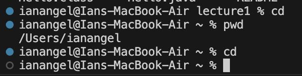
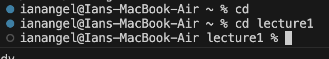
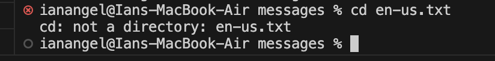
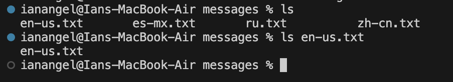
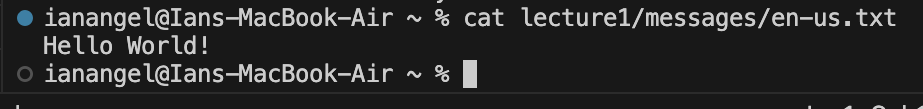

# Lab1 Report
    Lab 1 was indeed an interesting experience that allowed me to practice the basic concepts of using terminal commands. Throughout the lab session, I used commands such as `cd`, `ls`, and `cat`. Here's my report on them!

### `cd`:
#### 1. Using the command with no arguments
While running this command, the absolute path was: `/Users/ianangel`

When `cd` was used without any arguments, it resulted in nothing but returning to the home directory because no specific directory was specified. This output is not an error but expected behavior on a Mac machine.

#### 2. Using the command with a path to a directory as an argument
While running this command, the absolute path was: `/Users/ianangel/lecture1`

From the provided image, I first used `cd` to return to the home directory and then navigated to the `lecture1` directory using `cd lecture1`. This output is not an error and successfully changes to the desired directory.

#### 3. Using the command with a path to a file as an argument
While running this command, the absolute path remained: `/Users/ianangel/lecture1/messages` due to the occurring error.

As shown in the picture, `cd` cannot be used on a file because a file cannot be treated as a directory. This results in an error because a file lacks the capability to navigate to other locations.

### `ls`:
#### 1. Using the command with no arguments
While running this command, the absolute path was: `/Users/ianangel`

In this case, `ls` command showcases directories from my computer's home directory. This output is correct and doesn't result in an error since `ls` shows the contents and folders on my computer.

#### 2. Using the command with a path to a directory as an argument
While running this command, the absolute path was: `/Users/ianangel/lecture1`

In this case, `ls` command showcases the contents of the `lecture1` directory. This output is correct and doesn't result in an error since `ls` shows the contents and folders of `lecture1`.

#### 3. Using the command with a path to a file as an argument
While running this command, the absolute path was: `/Users/ianangel/lecture1/messages/`

In this case, while using `ls` command on a file (`en-us.txt`), it showcases the file name but not its contents. This output is not an error, but it doesn't display the content of the file.

### `cat`:
#### 1. Using the command with no arguments
While running this command, the absolute path was: `/Users/ianangel`

In this case, the `cat` command didn't do anything since there was no data to read. This output doesn't indicate an error; it simply does not perform any action.

#### 2. Using the command with a path to a directory as an argument
While running this command, the absolute path was: `/Users/ianangel`

The command `cat lecture1` resulted in an error since `cat` cannot operate on directories; it requires actual file content.

#### 3. Using the command with a path to a file as an argument
While running this command, the absolute path was: `/Users/ianangel/lecture1/messages`

Now, by accessing the `en-us.txt` file using the command `cat /lecture1/messages/en-us.txt`, it displays the content of the file. Since `cat` is designed for displaying the contents of files, the command executed without errors.
