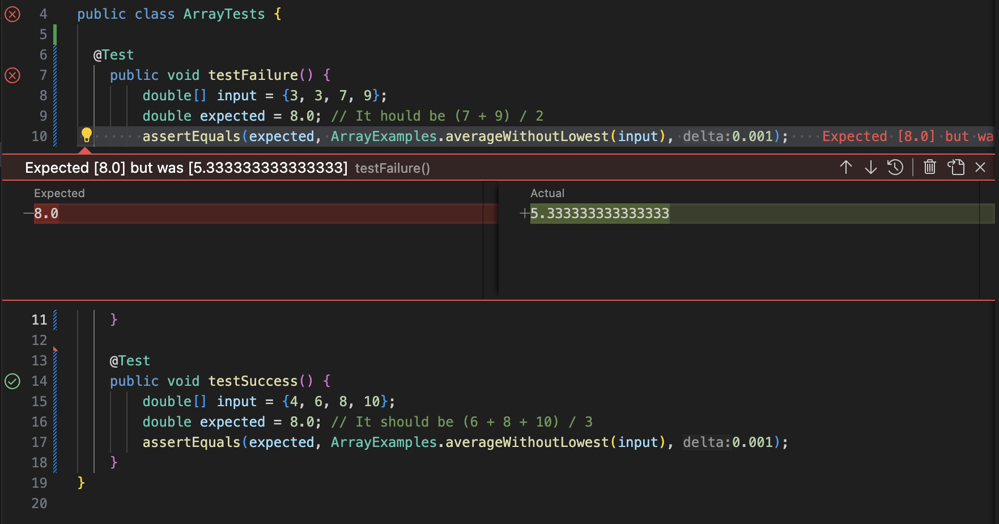

# Lab3 Report

## Part 1
For this Lab Report, I would like to choose `ArrayExamples.java` from week 4's lab.

### `A failure-inducing input:`
#### This is a JUnit test that demonstrates a failure when an array contains multiple occurrences of the lowest value, in this case, it's '3'.

    @Test
    public void testFailureAverageWithoutLowest(){
        double[] input = {3, 3, 7, 9};
        double expected = 8.0; // It should be (7 + 9) / 2
        assertEquals(expected, ArrayExamples.averageWithoutLowest(input), 0.001);
    }

### `Non-Failure-Inducing input:`
#### This JUnit test shows a case where the code works as expected because there is only one occurrence of the lowest value, which is '4'.
    
    @Test
    public void testSuccessAverageWithoutLowest() {
        double[] input = {4, 6, 8, 10}; 
        double expected = 8.0; // It should be (6 + 8 + 10) / 3
        assertEquals(expected, ArrayExamples.averageWithoutLowest(input), 0.001);
    }

### `The symptom, as the output of running the two tests:`
#### As shown in this screenshot, the test designed to verify failure handling has indeed failed, while the other test passed.

### `The bug, before-and-after`
#### Particularly in `ArrayExamples.java`, the bug is situated in the `averageWithoutLowest` method.

Here's the original code: 

    static double averageWithoutLowest(double[] arr) {
        if(arr.length < 2) { return 0.0; }
        double lowest = arr[0];
        for(double num: arr) {
          if(num < lowest) { lowest = num; }
        }
        double sum = 0;
        for(double num: arr) {
          if(num != lowest) { sum += num; }
        }
        return sum / (arr.length - 1);
    }

And, here's that code after the fix:

    static double averageWithoutLowest(double[] arr) {
        if(arr.length < 2) { return 0.0; }
        double lowest = arr[0];
        int lowestCount = 0;
        for(double num: arr) {
          if(num < lowest) {
            lowest = num;
            lowestCount = 1;
          } 
          else if (num == lowest) {
            lowestCount++;
          }
        }
        double sum = 0;
        for(double num: arr) {
          sum += num;
        }
        return (sum - lowest * lowestCount) / (arr.length - lowestCount);
    }

### `Explanation of the fix`
#### This fix adapts the same logic as before but uses different numerical examples. By counting all occurrences of the lowest number, we ensure the mean is calculated only from the numbers that aren't the lowest, correctly adjusting for multiple instances of the lowest value. Thus, this particular revision maintains the foundation of the initial solution while providing a unique test scenario and numbers, more suitable for various occasions.

## Part 2
For this Part, I choose the command `grep`.

### Option 1: `-i`
#### This option allows `grep` to match lines regardless of the case of the characters. It makes the search case-insensitive.

    grep -i "module" ./technical/config.txt
    grep -i "error" ./technical/logs/logfile.log

The first command searches for the word "module" in `config.txt` with no regard to uppercase or lowercase letters.
The second command searches for "error" in the `logfile.log`, it is for debugging without worrying about capitalization.

### Option 2: `-v`
#### This option prints out all the lines that don't match the pattern.

    grep -v "and" ./technical/document.txt
    grep -v "^#" ./technical/config.txt
    
The first command displays all lines in `document.txt` that do not contain the word "and".
The second command shows lines in `config.txt` that don't start with a #, which are used for comments.

### Option 3: `-n`
#### TThis option displays the line number in the file where each match is found.

    grep -n "error" ./technical/logs/error_line.txt
    grep -n "quit" ./technical/config/server.cfg
    
The first command searches for "error" in `error_line.txt` and prints each matching line with its respective line number. 
The second command looks for the term "quit" in `server.cfg` and includes line numbers in the output.

### Option 4: `-w`
#### This option ensures that grep matches patterns that form whole words.

    grep -w "start" ./technical/scripts/setup.sh
    grep -w "fail" ./technical/logs/launch.log
    
The first command searches for the whole word "start" in `setup.sh`.
The second command searches for the whole word "fail" in `launch.log`. 

### Citation
For the examples and explanations of the `grep` command options (`-i`, `-v`, `-n`, and `-w`), the following websites were used:

`https://docs.rackspace.com/docs/use-the-linux-grep-command` This source provided details about general usage and specific options for the grep command, helping to understand how each option modifies the command's behavior.

`https://www.geeksforgeeks.org/grep-command-in-unixlinux/` This article offers comprehensive examples and explanations of various `grep` command options, including their practical applications in searching within files and directories.

Besides that, I applied the knowledge I've gained from the lab by using it on my terminal.
