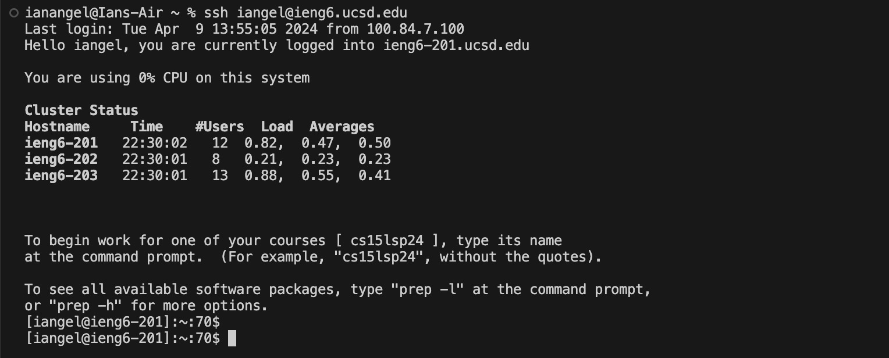
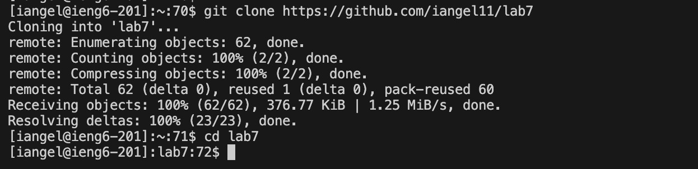
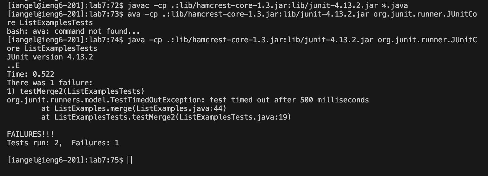
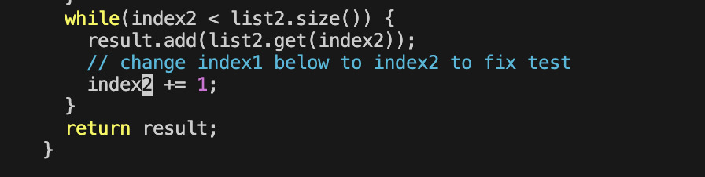
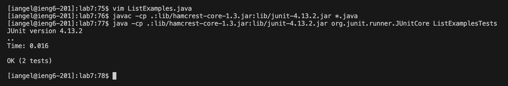
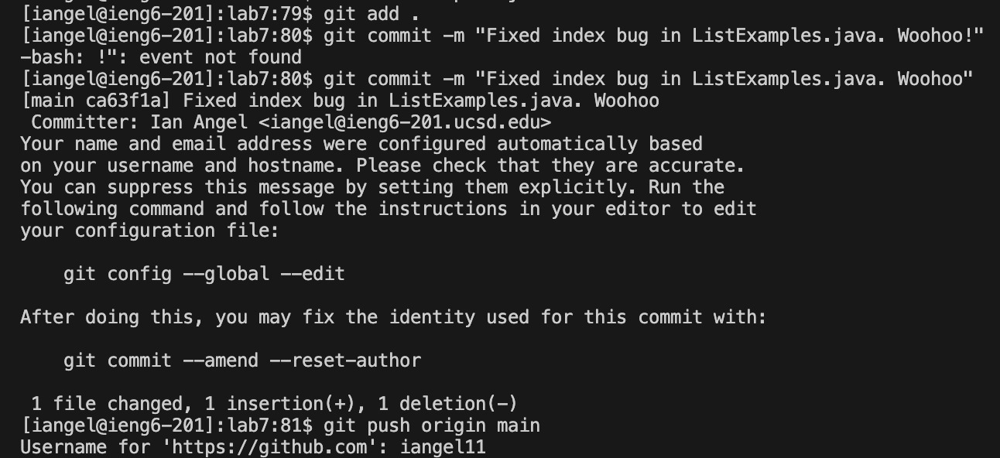

# Lab4 Report

#### This lab was very interesting and important to me! It was a wonderful opportunity to work with `vim`!

### Log into ieng6

#### Keys pressed:
  
  `ssh<space>iangel@ieng6.ucsd.edu<enter>` This command logs you into the ieng6 server.

### Clone the Repository

#### Keys pressed:

  `git<space>clone<space>git@github.com:iangel11/lab7.git<enter>` This command clones the forked repo of week 7 lab.
  
  `cd<space>lab7<enter>` This command changes the directory to lab7.
  
  These commands clone the fork of the repository and changes the directory to the cloned repository.

### Run the Tests

#### Keys pressed:

  `javac<space>-cp<space>.:lib/hamcrest-core-1.3.jar:lib/junit-4.13.2.jar<space>*.java<enter>`

  `java<space>-cp<space>.:lib/hamcrest-core-1.3.jar:lib/junit-4.13.2.jar<space>org.junit.runner.JUnitCore<space>ListExamplesTests<enter>`

  These commands compile the Java files and run the JUnit tests, demonstrating their failure.

### Edit the Code with Vim to Fix the Failing Test

#### Keys pressed:

  `vim<space>ListExamples.java<enter>` Opens the file in Vim.

  `/index1<enter>` Searches for the term "index1".

  `n`
  `n`
  `n`
  `n`
  `n`
  `n`
  `n`
  `n`
  `n` Finds the next occurrence (did it 9 times to get to the desired index1).

  `i` Enters the text editor in Vim.

  `<right><right><right><right><right><right><backspace>2` 
   First, I moved cursor to the `right` once in the editor (done 6 times to get to the number `1`). Then, I used `backspace` to delete `1` from index and then I pushed `2` to change it to 2 from the blank.

  `<esc>` To quit the text editor.

  `:wc` Saves and quits Vim.

### Re-run the Tests

#### Keys pressed:

  `<up><up><up><up><enter>` I used it to run the previous `javac` command from history (it was 4 up-arrows in the search history).
  
  `<up><up><up><up><enter>` I used it to run the previous `java` command from history (it was 4 up-arrows in the search history and then accessed and ran the same way as I did `javac`).

### Commit and Push Changes

#### Keys pressed:

  `git<space>add<space>.<enter>` Stages all changes.
  
  `git<space>commit<space>-m<space>"Fixed index bug in ListExamples.java. Woohoo"<enter>` Commits the changes with a message.
  
  `git<space>push<space>origin<space>main<enter>` Pushes the changes to the repository.
