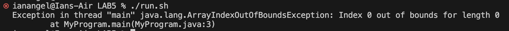
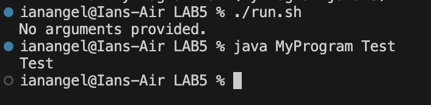

# Lab5 Report

### Part 1 – Debugging Scenario

#### Student:
Hi everyone, I'm having an issue with my Java program. I'm trying to run a script that compiles and runs a simple Java application, but I'm getting some unexpected behavior. When I run my Bash script, it seems like the Java program isn't executing correctly. Here's a screenshot of the error I'm seeing:

I'm guessing it has something to do with how I'm passing arguments to the Java program, but I'm not sure. The input to the Bash script should trigger this issue.

#### TA:
Hi! It looks like the issue might be related to how the arguments are being handled in your Java program. Could you try running the Java program directly from the terminal with the same arguments you're using in the script? Also, please share the contents of your Bash script and the command you're using to run it.

#### Student:
Alright, I actually ran the Java program directly with no arguments and got that output I already sent you. It seems like the program is trying to access an array element that doesn't exist. Here's the code for my Java program itself and the Bash script:

Looks like the issue is with accessing args[0] without checking if any arguments were passed. What do you think?

#### TA:
Great, it looks like you've identified the problem. The issue is that your Java program is trying to access the first argument without checking if any arguments were passed. To fix this, you should add a check to ensure that args is not empty before accessing it. Here's how you can modify your MyProgram.java:

Try updating your code with this check and then run your script again.

#### Student:
Thank you so much, that worked! After adding the check, the program runs correctly whether or not arguments are provided. Here's the updated output, I also used it with some argument to test it again:

#### TA:
You're welcome!

### Part 2 – Reflection

During the second half of this quarter, I learned a lot about debugging and the importance of validating inputs in my programs, as well as how to use Vim! This experience taught me to anticipate potential issues and handle them proactively, making my programs more reliable. Also, I absolutely loved learning about Vim, it felt kind of cryptic and a bit serious  but that's why I enjoyed gaining knowledge on it and mastering it. Thank you so much!
